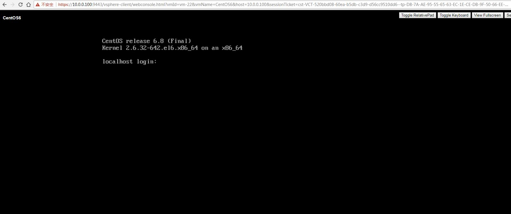

# VMware vSphere python api

Software versions,
python 2.7.14
download from following link,
https://www.python.org/downloads/release/python-2714/

python modules,
shows in the requirements.txt

    pip install -r requirements.txt

# Usage
    
    
    -s vcenter ip address
    -o vcenter listening port
    -u username
    -p password
    -n VM name
    -m CDROM number id, for example 1
    -i ISO file location, for example [ds1]centos.iso
    -t Template
    -c cluster of the new vm
    -cpu vm cpu core number
    -mem vm memory size (GB)
    -ip vm ip address
    -mask vm network mask
    -gw vm network gateway
    -dns vm dns servers
    -domain vm default domain name
    -e esxi
    

#### 010 VM operations
poweron VM

    python 001poweron.py -s vcip -o 443 -u administrator@vsphere.local -p password -n CentOS6

poweroff VM

    python 002poweroff.py -s vcip -o 443 -u administrator@vsphere.local -p password -n CentOS6

reboot VM

    python 003reboot.py -s vcip -o 443 -u administrator@vsphere.local -p password -n CentOS6

suspend VM

    python 004suspend.py -s vcip -o 443 -u administrator@vsphere.local -p password -n CentOS6

reset VM

    python 005reset.py -s vcip -o 443 -u administrator@vsphere.local -p password -n CentOS6

delete VM

    python 006destroy.py -s vcip -o 443 -u administrator@vsphere.local -p password -n CentOS6

#### 020 VM web console

Attach ISO file to VM

    python 021cdrom.py -s vcip -o 443 -u administrator@vsphere.local -p password -n CentOS6 -m 1 -i [ds1]centos.iso

Deattach ISO file from VM

    python 021cdrom.py -s vcip -o 443 -u administrator@vsphere.local -p password -n CentOS6 -m 1

Return the VM web console

    python 022console.py -s vcip -o 443 -u administrator@vsphere.local -p password -n CentOS6
    
    Output:
    Open the following URL in your browser to access the Remote Console.
    You have 60 seconds to open the URL, or the sessionwill be terminated.
    
    https://10.0.0.100:9443/vsphere-client/webconsole.html?vmId=vm-22&vmName=CentOS6&host=10.0.0.100&sessionTicket=cst-VCT-520bbd08-60ea-b5db-c3d9-d56cc9510dd6--tp-D8-7A-AE-95-55-65-63-EC-1E-CE-DB-9F-50-66-EE-9F-4D-CF-2E-BD&thumbprint=D8:7A:AE:95:55:65:63:EC:1E:CE:DB:9F:50:66:EE:9F:4D:CF:2E:BD
    Waiting for 60 seconds, then exit

Please open this link in the browser.

#### 030 Clone VM

The template vm must have the vmtools installed.

    python 031clonevm.py -s vcip -o 443 -u administrator@vsphere.local -p password -t template_vm_name -n new_vm_name -c cluster -cpu 1 -mem 2 -ip 10.0.0.240 -mask 255.255.255.0 -gw 10.0.0.2 -dns 10.0.0.2 -domain domain.com
    
    Output:
    Stage 1: Cloning VM...
     Clone VM task state: running
     Clone VM task state: running
     Clone VM task state: success
    Stage 2: Configuring VM CPU and Memory...
     Configure VM CPU and Memory task state: success
    Stage 3: Reconfiguring VM Networks . . .
     Reconfigure VM network task state: success
    Stage 4: Powering on VM . . .
     PowerON VM task state: success
    

#### 040 Get VM status
get the vm running status.

    python 040vmstatus.py  -s vcip -o 443 -u administrator@vsphere.local -p password -n CentOS6
    
    Output:
    poweredOn

#### 050 Get VM list from VMhost

    python 050getvmlist.py  -s vcip -o 443 -u administrator@vsphere.local -p password -e 10.0.0.130
    
    Output:
    CentOS6
    Windows XP

#### 060 Get VMhost from vm 
    
    python 060getvmhost.py -s vcip -o 443 -u administrator@vsphere.local -p password -n CentOS6
    
    Output:
    10.0.0.130
    

#### 070 Get VM matrics

    python 070getvmmetrics.py -s vcip -o 443 -u administrator@vsphere.local -p password -n CentOS6
    
    Output:
    NOTE: Any VM statistics are averages of the last 15 minutes
    
    Server Name   : CentOS6
    Description   :
    Guest : CentOS 4/5/6/7 (64-bit)
    Snapshot Status   : Snapshots present
    VM .vmx Path  : [ds1] CentOS6/CentOS6.vmx
    Virtual Disks : Hard disk 1 | 16.0GB | Thin: True | [ds1] CentOS6/CentOS6-000001.vmdk
    Virtual NIC(s): Network adapter 1 | VM Network | 00:50:56:8c:8b:7c
    Number of vCPUs   : 1
    CPU Ready : Average 0.1 %, Maximum 0.1 %
    CPU (%)   : 1 %
    Memory: 1024 MB (1.0 GB)
    Memory Shared : 0 %, 0 MB
    Memory Balloon: 0 %, 0 MB
    Memory Swapped: 0 %, 0 MB
    Memory Active : 4 %, 36 MB
    Datastore Average IO  : Read: -0 IOPS, Write: 0 IOPS
    Datastore Average Latency : Read: 0 ms, Write: 0 ms
    Overall Network Usage : Transmitted 0.000 Mbps, Received 0.000 Mbps

#### 080 Get VMhost matrics

    python 080esximatrics.py -s vcip -o 443 -u administrator@vsphere.local -p password -e 10.0.0.130
    
    Output:
    ESXi Name: 10.0.0.130
    ESXi CPU Detail  : Processor Sockets: 2, Cores per Socket 2
    ESXi CPU Type: Intel(R) Core(TM) i7-3630QM CPU @ 2.40GHz
    ESXi CPU Usage   : Used: 183 Mhz, Total: 9576 Mhz
    ESXi Memory Usage: Used: 2 GB, Total: 4 GB
    